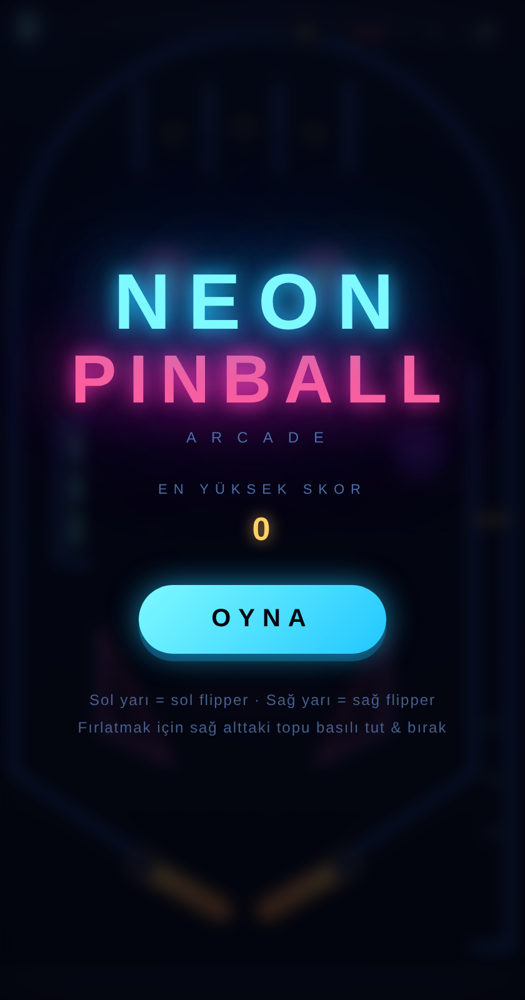
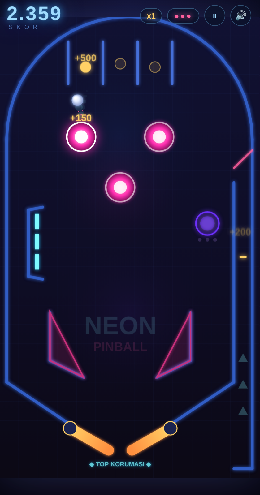

# 🕹️ Neon Pinball

Telefon için geliştirilmiş, tam özellikli, neon temalı profesyonel pinball oyunu.
Saf HTML5 Canvas + WebAudio ile yazıldı — sıfır bağımlılık. Android APK olarak kurulabilir.

<p align="center">
  
  
</p>

## ✨ Özellikler

- **Bölüm sistemi & rastgelelik**: Her bölümün bir hedef puanı vardır; hedefe ulaşınca +1 top kazanılır ve **rastgele üretilen** yeni bir bölüme geçilir. Dizilim de her bölümde değişir: 2-4 bumper, hedef bankı sol/sağ tarafta (3-4 hedef), 2-4 rollover şeridi, değişken saucer konumu ve yerçekimi
- **8 özgün tema, 8 farklı oyun konsepti** — her bölüm hem görsel olarak hem de **oynanış olarak** bambaşkadır:
  - **Teknik Çizim** · *Raylı Bumperlar*: plan kağıdı estetiği; bumperlar kesikli raylar üzerinde sürekli hareket eder
  - **Retro CRT** · *Piksel Tuğlalar*: masanın ortasında kırılabilir 15'lik tuğla duvarı — hepsini temizle, bonus kap
  - **Günbatımı** · *Çöl Rüzgarı*: yön ve şiddeti değişen rüzgar topu savurur; üstteki gösterge rüzgarı gösterir
  - **Derin Okyanus** · *Su Altı Fiziği*: düşük yerçekimi + su direnci; denizanası bumperlar yüzerek yer değiştirir
  - **Volkan** · *Püskürme*: ortadaki gayzer önce uyarı verir, sonra patlar ve yakındaki topu göğe fırlatır
  - **Galaksi** · *Yerçekimi Kuyuları*: gezegen bumperlar topu kendine çeker, top kavisli yörüngeler çizer
  - **Orman** · *Büyüyen Mantarlar*: mantar bumperlar nefes alır gibi büyüyüp küçülür — çarpışma alanı da değişir
  - **Şeker** · *Şurup Havuzları*: masadaki yapışkan şurup gölcükleri topu yavaşlatır
  - HUD renkleri, duvar stili, top izi, ortam parçacıkları ve ses geri bildirimleri temayla birlikte değişir
- **Gerçekçi fizik**: 240 Hz alt adımlı fizik motoru, dönen flipper çarpışmaları, top-top çarpışması (multiball)
- **Masa öğeleri**: 3 pop bumper, 2 slingshot, 3'lü drop target bankı, rollover şeritleri, spinner, saucer (kilit çukuru), tek yön kapılı fırlatma kanalı
- **Oyun mekanikleri**:
  - Skor çarpanı (drop target bankını tamamla → x8'e kadar)
  - 3 kilit → **MULTIBALL** (2x skor)
  - Top koruması (her serviste 12 sn)
  - Ekstra top (200K / 500K / 1M puanda)
  - Şarjlı plunger ile fırlatma
  - **Kombo**: art arda (1,3 sn içinde) bumper/hedef/şerit vuruşları kombo sayacını artırır; her 3 vuruşta bonus puan + "KOMBO xN" bildirimi
  - **Dürtme (nudge) & TILT**: masayı dürtme düğmesiyle (veya `N` tuşuyla) sıkışan topu kurtar; 8 saniyede 3'ten fazla dürtersen **TILT** olursun — flipperlar birkaç saniye kilitlenir
- **Görsel & ses**: Malzeme kalitesi — pahlı (bevel) duvarlar, perçin detayları, film greni + vinyet, krom top (temas gölgesi, spekülar parlama, zemin yansıması), kauçuk uçlu flipperlar, çukur görünümlü saucer; parçacıklar, ekran sarsıntısı, WebAudio ile sentezlenen ses efektleri, titreşim (haptik) desteği
- **Performans**: Bumper ve ışıma sprite önbelleği (kare başına gradyan/gölge üretimi yok), tek geçişli top izi, statik masa katmanı; kare süresi uzarsa **otomatik kalite ölçekleme** çözünürlüğü kademeli düşürür
- **Mobil öncelikli**: Çoklu dokunuş (iki flipper aynı anda), portre tam ekran, her çözünürlüğe uyum
- **Kayıt**: En yüksek skor ve ses (sessiz/açık) tercihi cihazda kalıcı olarak saklanır

## 🎮 Kontroller

| Eylem | Dokunmatik | Klavye |
|---|---|---|
| Sol flipper | Ekranın sol yarısı | `←` veya `Z` |
| Sağ flipper | Ekranın sağ yarısı | `→` veya `M` |
| Fırlatma | Sağ alttaki topa basılı tut & bırak | `Boşluk` (basılı tut) |
| Dürt (nudge) | ✦ düğmesi | `N` |
| Duraklat | ⏸ düğmesi | `P` |

## 📦 APK Kurulumu

APK her push'ta GitHub Actions tarafından otomatik derlenir ve imzalanır.

1. **Actions** sekmesi → son "APK Derle" çalıştırması → **NeonPinball-APK** artifact'ını indir
2. Zip'ten çıkan `NeonPinball.apk` dosyasını telefona aktar
3. Telefonda dosyaya dokun → "Bilinmeyen kaynaklardan kuruluma izin ver" → Kur

Kalıcı sürüm yayınlamak için bir sürüm etiketi gönder; APK otomatik olarak **Releases** sayfasına eklenir:

```bash
git tag v1.0.0 && git push origin v1.0.0
```

> Not: Gereken minimum Android sürümü 8.0 (API 26).

## 🛠️ Geliştirme

```bash
# Tarayıcıda oyna (masaüstünde klavye ile test edilebilir)
cd web && python3 -m http.server 8080
# http://localhost:8080

# APK'yı yerelde derle (Android SDK gerektirir)
gradle -p android assembleRelease
# Çıktı: android/app/build/outputs/apk/release/app-release.apk
```

### Proje yapısı

```
web/            Oyunun tamamı (index.html, style.css, game.js)
android/        WebView tabanlı Android sarmalayıcı (oyunu asset olarak paketler)
.github/        APK derleyen CI işlem hattı
docs/           Ekran görüntüleri
```

Oyun dosyaları `android/app/build.gradle` içindeki `assets.srcDirs` ayarıyla doğrudan `web/`
klasöründen paketlenir — kod tekrarı yoktur; web sürümü ile APK her zaman aynıdır.
