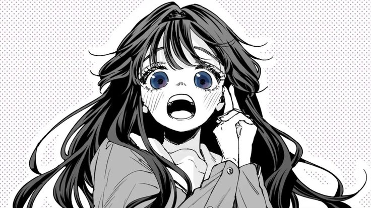
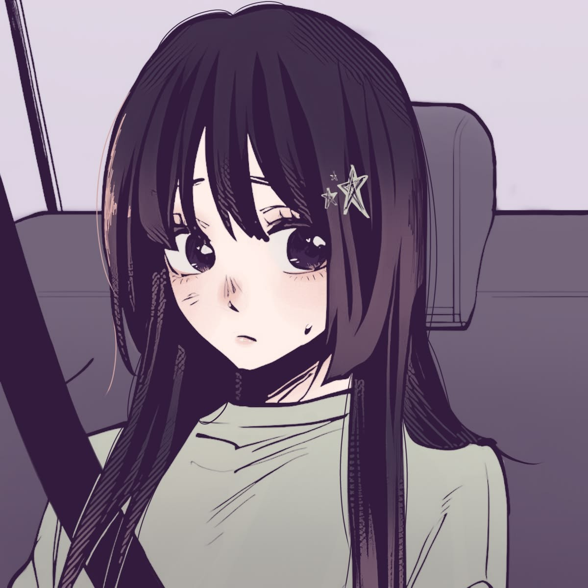
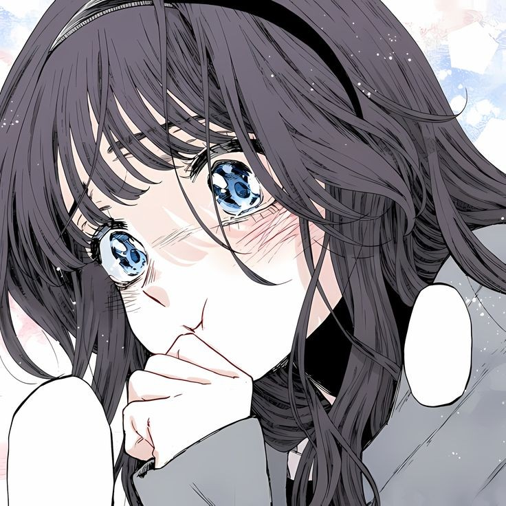
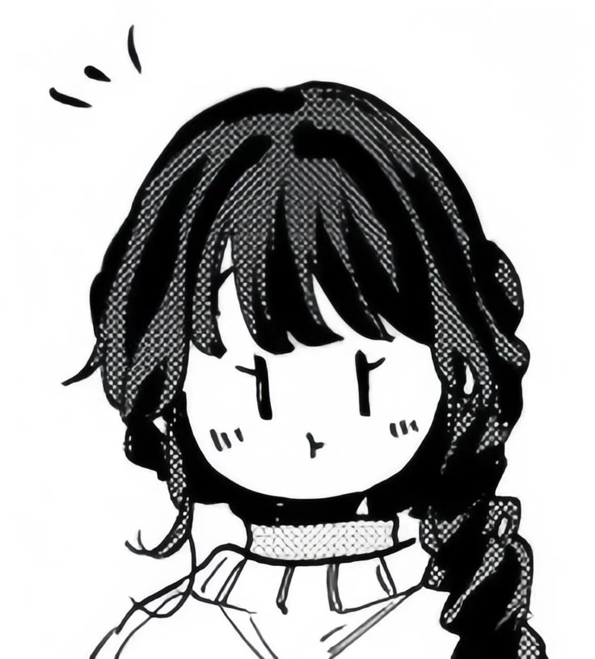

<!-- 🖼️ GÖRSEL 1: img/banner.webp — 1200×400px
     Karanlık atmosferik sahne — anime bg, cyberpunk, dark corridor
     MiyagawaMizu'nun bg.webp'si gibi tam genişlik açılış görseli -->


<a href="https://github.com/BocchiV"></a>

<br/>

### `ghost signal detected`

```
  ██╗   ██╗
  ██║   ██║
  ╚██╗ ██╔╝
   ╚████╔╝
    ╚═══╝   — AfterLife
```

- location: **AfterLife**
- occupation: **building Project Lydia**
- stack: **TypeScript · React · Node.js · Python**
- signal: **still broadcasting**
- status: **probably overthinking it**

<br/><br/>


---

<!-- 🖼️ GÖRSEL 2: img/char_2.webp — ~140px genişlik, align=left
     Küçük karakter görseli — oturan/yan bakan, gizemli
     Piksel/chibi ya da atmosferik küçük karakter -->
## **⚡ stack**

<a href="https://github.com/BocchiV"></a>

<br/>

<div>


</div>

<br clear="left"/><br/>

---

## **📡 signal trace**

<!-- 🖼️ GÖRSEL 3: img/char_3.webp — ~120px genişlik, align=right
     Üzgün/düşünceli küçük karakter — MiyagawaMizu'nun marin_sad gibi -->
<a href="https://github.com/BocchiV"></a>

<p align="center"></p>

<p align="center">
<picture>
  <source media="(prefers-color-scheme: dark)" srcset="https://raw.githubusercontent.com/BocchiV/BocchiV/output/github-snake-dark.svg"/>
  <source media="(prefers-color-scheme: light)" srcset="https://raw.githubusercontent.com/BocchiV/BocchiV/output/github-snake.svg"/>
  
</picture>
</p>

<br/>

---

## **🔒 classified**

<!-- 🖼️ GÖRSEL 4: img/char_4.webp — ~120px genişlik, align=left
     Küçük smugface/gizemli bakan karakter — MiyagawaMizu'nun marin_smug gibi -->
<a href="https://github.com/BocchiV"></a>

<br/>

```
i build in a city that forgot the sun.

Project Lydia is not just a project —
it's a signal sent into the void.

AfterLife is not a place.
it's what remains after the noise stops.
```

<br clear="left"/><br/>

---

<p align="center">

<br/><sub>— Raven</sub>
</p>

<br/>
